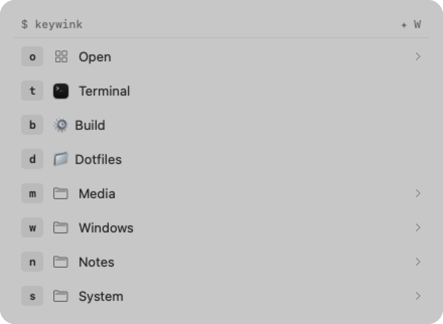
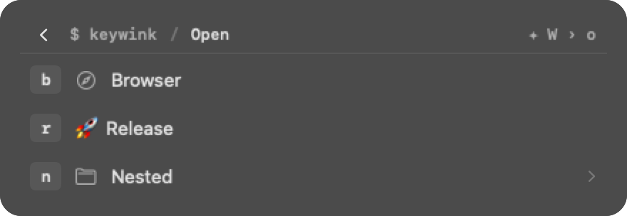

<p align="center">
  
</p>

# Keywink

A native macOS command launcher driven by memorable key sequences. Press one shortcut, then type a few letters, and Keywink opens apps, URLs, folders, or runs commands. A compact on-screen guide shows what each key does, so you never have to memorise a shortcut table.

<p align="center">
  <picture>
    <source media="(prefers-color-scheme: dark)" srcset="docs/images/key-guide-dark.png">
    
  </picture>
</p>

Keywink is an independent fork of [Leader Key](https://github.com/mikker/LeaderKey) by Mikkel Malmberg and contributors. Their history and [MIT license](LICENSE) are preserved. Keywink has its own app identity, so it can run alongside Leader Key.

## Why Keywink

- **Sequences instead of chords.** `o` then `m` opens Messages. Nest groups as deep as you like; the guide follows you down and Backspace takes you up one level.
- **Key Guide.** A centered, single-column guide styled after editor completion lists: key badge first, then icon and name, with global shortcut hints on the right. Native materials, light and dark appearance, reduced motion and transparency respected.
- **Hyper group shortcuts.** Bind a global shortcut, such as Hyper+G, straight to a group and jump into it with one press. The guide shows **✦** for Hyper (Control–Option–Shift–Command).
- **Local usage statistics.** See which shortcuts you use from which app, and optionally rank the guide by frequency. Counts never leave your Mac.
- **Text and shortcut actions.** Type a snippet or press a key combination in the app you came from, next to apps, URLs, folders, and commands.
- **Repeat and toggle.** A shortcut repeats the last action; optionally an application action hides the app that is already in front.
- **JSON, TOML, or KDL configuration** with a built-in editor, validation, automatic saving, conversion between formats, and import from any of them. Icons can be apps, SF Symbols, or image files.
- **Automation** through `keywink://` URLs.

## Install

Download the latest `Keywink-<version>.zip` from [Releases](https://github.com/niklas-heer/Keywink/releases), unzip it, and move `Keywink.app` to Applications. Keywink runs as a menu bar item.

Releases are signed with a Developer ID certificate and notarized by Apple, so the app opens without extra steps. Verify downloads against the `.sha256` file attached to each release.

Keywink requires macOS 13 Ventura or later and runs natively on Apple Silicon and Intel. There is no Homebrew cask yet.

## Quick start

1. Click the Keywink menu bar item and choose **Settings…**.
2. Under **General**, record the shortcut that opens the launcher.
3. Add actions and groups in the configuration editor. Each item gets a single key.
4. Press your shortcut, then the keys. **Escape** dismisses the guide.

**Settings → General → Repeat last action** records a second shortcut that runs the previous action again without opening the guide. **Settings → Advanced → Hide an app that is already in front** turns application actions into toggles.

Actions can be applications, URLs, folders, shell commands, typed text, or key shortcuts sent to the app you were in.

## Text and shortcut actions

A **Text** action types its value into the frontmost app, so a snippet like a sign-off or an email address is one key sequence away. A **Shortcut** action presses a key combination there instead, for example `cmd+shift+4` for a screenshot or `⌘⇧T` to reopen a tab. Modifiers are `cmd`, `shift`, `alt`/`opt`, `ctrl`, `fn`, and `hyper`; keys are letters, digits, punctuation, `space`, `return`, `tab`, `escape`, `backspace`, `delete` (forward), arrows, and `f1` to `f12`. Glyphs such as `⌘⇧4` work too.

Both actions need the Accessibility permission. macOS asks the first time one runs; afterwards allow Keywink under **System Settings → Privacy & Security → Accessibility**. Keywink closes its guide before sending input, so these actions always end sticky mode.

## Key Guide

<p align="center">
  
</p>

The guide sits in the middle of the active display and keeps a steady width and center while its height follows the current group, up to ten rows before scrolling. The header shows the path to the current group on the left and the key sequence that reaches it on the right, where **›** means "then".

- **Backspace** or the back arrow moves up one level. At the root it does nothing.
- **Escape** hides the guide.
- Labels that start with an emoji use it as the icon. The icon menu also offers app icons, SF Symbols, and image files (PNG, JPEG, ICNS).
- **Settings → General → Theme** switches to the other themes inherited from Leader Key. Existing "Top Edge" selections map to Key Guide.

## Groups and Hyper shortcuts

Give a top-level group a key, then use **Record Shortcut** beside it to assign a global shortcut. For example, bind Hyper+G to an applications group, release Hyper, and press `T` for Terminal. Group shortcuts always open their group from the root, even when another group is open.

If Raycast or another utility supplies Hyper, keep it running and match its **Include Shift** setting. Avoid binding a combination another launcher already owns. Global shortcuts are stored in Keywink's preferences, not in the JSON configuration.

## Usage statistics

**Settings → Statistics** shows launcher opens, group views, and action selections grouped by the app you were in when Keywink opened. Window titles, document contents, commands, and URLs are never recorded.

- **Track usage** pauses counting when turned off. **Reset statistics** clears history.
- **Rank via frequency** is off by default. When on, Key Guide orders siblings by how often you use them from the current app, falling back to overall counts. Ties keep configured order, keys never change, and the JSON file is never reordered.

Counts follow key paths, so reassigning a key inherits that path's history until reset.

## Configuration file

Keywink stores its configuration as `config.json` under `~/Library/Application Support/Keywink/` (change the directory under **Settings → Advanced**). The editor writes the file on every change; edit it by hand and choose **Read from file** or `keywink://config-reload` to pick up external changes.

Prefer comments and less punctuation? Switch **Settings → Advanced → Format** to TOML or KDL. Keywink rewrites the configuration as `config.toml` or `config.kdl`, keeps the previous file as a backup, and uses the new file from then on. Switch back the same way.

TOML keeps the JSON structure with the same field names:

```toml
type = "group"

[[actions]]
key = "o"
type = "group"
label = "Open"

  [[actions.actions]]
  key = "s"
  type = "application"
  value = "/Applications/Safari.app"

[[actions]]
key = "e"
type = "text"
label = "Email"
value = "hello@example.com"
```

[KDL](https://kdl.dev) is the most compact: one node per item, where the node name is the action type, the first value the key, the second the target, and `label=` and `icon=` are optional. Groups nest their items in braces. Comments, `/-` to disable a node, raw strings (`#"..."#`), and multi-line strings all work.

```kdl
group "o" label="Open" {
    application "s" "/Applications/Safari.app"
    url "g" "https://google.com" label="Google"
    shortcut "4" "cmd+shift+4" label="Screenshot"
}
text "e" "hello@example.com" label="Email" icon="~/icons/mail.png"
```

## Import a configuration

Choose **Settings → General → Import configuration…** and select a JSON, TOML, or KDL file. Keywink validates it, backs up its current configuration, and writes the import in whichever format is active, so a KDL file can replace a JSON configuration and the other way round. The original is left untouched.

This is also how you move from Leader Key: its `config.json` lives under `~/Library/Application Support/Leader Key/`, and the panel opens there when that folder exists. Only the configuration is imported. Record your activation shortcut and preferences in Keywink, and update any `leaderkey://` automation URLs to `keywink://`. Do not give both apps the same global shortcut.

## Automation

```sh
open 'keywink://activate'
open 'keywink://hide'
open 'keywink://reset'
open 'keywink://repeat'
open 'keywink://settings'
open 'keywink://about'
open 'keywink://config-reload'
open 'keywink://config-reveal'
open 'keywink://navigate?keys=a,b,c'
open 'keywink://navigate?keys=a,b,c&execute=false'
```

Unknown commands show the launcher. Keywink does not register or handle Leader Key's URL scheme.

## Compared to Leader Key

Keywink started as a fork of [Leader Key](https://github.com/mikker/LeaderKey), whose upstream issues and pull requests were open and unanswered for months. Beyond the Key Guide theme and usage statistics, these upstream reports are addressed here:

| Upstream | What Keywink does |
| --- | --- |
| [#304](https://github.com/mikker/LeaderKey/issues/304), [PR #313](https://github.com/mikker/LeaderKey/pull/313) | Tests run against a private preferences suite, temporary configuration directories, and in-memory global shortcuts, so they never touch your data. |
| [#289](https://github.com/mikker/LeaderKey/issues/289), [#290](https://github.com/mikker/LeaderKey/issues/290) | Deleting or renaming a group releases its global shortcut. Shortcuts of groups that no longer exist are not registered. |
| [#321](https://github.com/mikker/LeaderKey/issues/321) | The configuration is loaded before the global shortcut is registered, so the first activation never shows an empty root. |
| [#223](https://github.com/mikker/LeaderKey/issues/223) | Sticky mode survives an action that brings another app to the front. |
| [#163](https://github.com/mikker/LeaderKey/issues/163) | A **Repeat last action** shortcut and `keywink://repeat`. |
| [#96](https://github.com/mikker/LeaderKey/issues/96), [#189](https://github.com/mikker/LeaderKey/issues/189) | Optional toggle behaviour: an application action hides the app when it is already in front. |
| [#322](https://github.com/mikker/LeaderKey/issues/322), [#316](https://github.com/mikker/LeaderKey/issues/316) | **Text** and **Shortcut** actions type into, or press a key combination in, the app you came from. |
| [PR #300](https://github.com/mikker/LeaderKey/pull/300) | Image files as icons for actions and groups. |
| [#68](https://github.com/mikker/LeaderKey/issues/68), [PR #303](https://github.com/mikker/LeaderKey/pull/303) | Optional TOML or KDL configuration, converted from Settings, plus import from any of the three formats. |
| [#262](https://github.com/mikker/LeaderKey/issues/262), [#259](https://github.com/mikker/LeaderKey/issues/259), [#204](https://github.com/mikker/LeaderKey/issues/204), [#185](https://github.com/mikker/LeaderKey/issues/185) | Already handled by Keywink's rewritten editor and settings: uppercase keys, groups that stay expanded while editing, sorting, and showing the guide on the screen with the mouse. |

Keywink is not affiliated with Leader Key. Leader Key configurations can be imported (see above); nothing is shared automatically.

## Development

Install Xcode with the macOS SDK, complete its first-launch setup, and install [mise](https://mise.jdx.dev/). Xcode provides Swift and the formatter; Swift Package Manager dependencies are locked in the project. No Homebrew packages are required.

```sh
mise trust
mise run build     # unsigned Debug build
mise run test      # isolated test suite
mise run check     # strict lint, script syntax, and tests (what CI runs)
mise run format    # rewrite Swift sources in place
mise run snapshots # render the Settings panes to build/snapshots/*.png
```

Tests use temporary configuration directories and a process-private preferences domain, so they never touch your real configuration. See [AGENTS.md](AGENTS.md) for the architecture and coding guidelines, and [RELEASE.md](RELEASE.md) for signing, notarization, and packaging.

## Releases and updates

Builds are published on [GitHub Releases](https://github.com/niklas-heer/Keywink/releases). Keywink does not check for updates yet: Sparkle stays disabled until Keywink has its own HTTPS appcast and signing key. Until then, download new versions from the releases page.

## Contributing

Issues and pull requests are welcome in [Keywink's issue tracker](https://github.com/niklas-heer/Keywink/issues). The [decision records](decisions/) explain the fork baseline and the choices made since; new significant choices get a record too. Upstream fixes are reviewed against a focused command-launcher scope.

## License

MIT. See [LICENSE](LICENSE).
